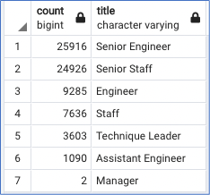
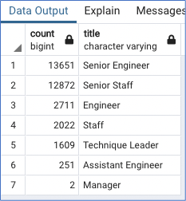
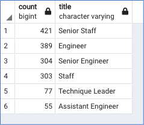
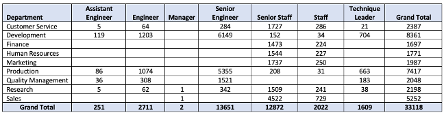
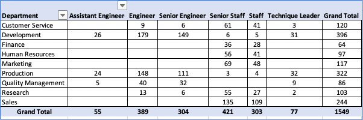

# Pewlett-Hackard-Analysis

## Overview

Pewlett Hackard is looking ahead to plan for a potentially large number of retirements. Human Resources implemented employee research to determine which employees will be retiring and how many positions will need to be filled. An employee database was designed utilizing SQL to manage the company’s current 300,024 employee records.  This analysis examined which employees are eligible for a retirement package and provide insight into managing a wave of upcoming retirements through a potential mentorship program.

## Results

### Anticipated Retirees By Title

Those expected to retire were determined by a query of employees who were born between January 1, 1952 and December 31, 1955 and the title that these employees held in the company. Because employees may have had more than one title during their employ, the data was filtered to the last title the employee held. This information is provided in the table. 

The query was then modified to narrow it down by including only those with a hire date between January 1, 1985 and December 31, 1988. This information is provided in the table below.

The following points can be observed in the table which includes both the birth dates and hire dates.

* The total number of employees represented in the table is 33,118. This accounts for approximately 11% of all total employees that are eligible for retirement.
* There are 7 unique titles within the company. Of these, approximately 50% hold the title of Assistant Engineer, Engineer or Senior Engineer that could potentially retire.  Approximately 45% of the potential retirees are composed of staff or senior staff.
* These trends hold true whether the hire date is in included in the query or not.

### Eligibility for Mentorship Program

Because of the anticipation of the large number of retiring employees, discussion of a new mentoring program for employees getting ready to retire has been underway. This would involve asking a potential retiree to step into a part-time role instead of retiring completely and serve as a mentor to newly hired employees. The examination of employees included in this analysis had a birth date between January 1, 1965 and December 31, 1965. This data was examined in relation to what title they hold. The results are provided in the table. 

The following points can be observed in the table:

* The total number of employees eligible to participate in a mentorship program is 1,549. Notice that there are only 6 titles with no managers eligible for this program.
* Of the remaining titles, approximately 47% are composed Staff or Senior Staff titles whereas approximately 48% are composed of Assistant Engineer, Engineer or Senior Engineer.

### Summary
The greatest impact that Pewlett Hackard should expect as retirements commence will most likely be within those holding titles of engineer or staff. However, engineers and staff work in varying departments so a query to see the impact on each department is needed for further insight. Additional queries were designed to determine the department each retiree currently works and then totals were found for each department. Once the data were aggregated, a CSV file was exported to Excel and a pivot table was created. 

When considering the various levels of engineers, some departments have a large number while others have a small number. Those departments such as Research or Customer Service would likely feel the impact the most and should be a focus of attention as mentorship projects are designed. Although staff have a greater presence among departments, the numbers are greater and thus less likely to feel a vast impact unless many employees retire within a very short time frame. 

For the mentorship to have the greatest chance of success, it would wise to have a mentor within the same department as the new hire so that job responsibilities are similar. Additional queries were conducted to examine availability of potential mentors across departments. Then a pivot table was created. 

An examination of the ratio of potential mentors to potential retirees reveals that there may not be enough eligible mentors available to train new employees replacing those who retire. If no distinction is made between the level of title among engineers, the ratio of mentors to retirees exceeds 1:20 in each department that engineers work. If no distinction is made between the level of title of staff, the ratio of mentors to retirees ranges from 1:17 up to 1:34. Although one mentor could train more than one employee, these ratios still suggest that there are not enough potential mentors. Perhaps Pewlett Hackard could reconsider who could be eligible for the mentorship by broadening the date parameters or provide some sort of incentives for other employees to become mentors.
